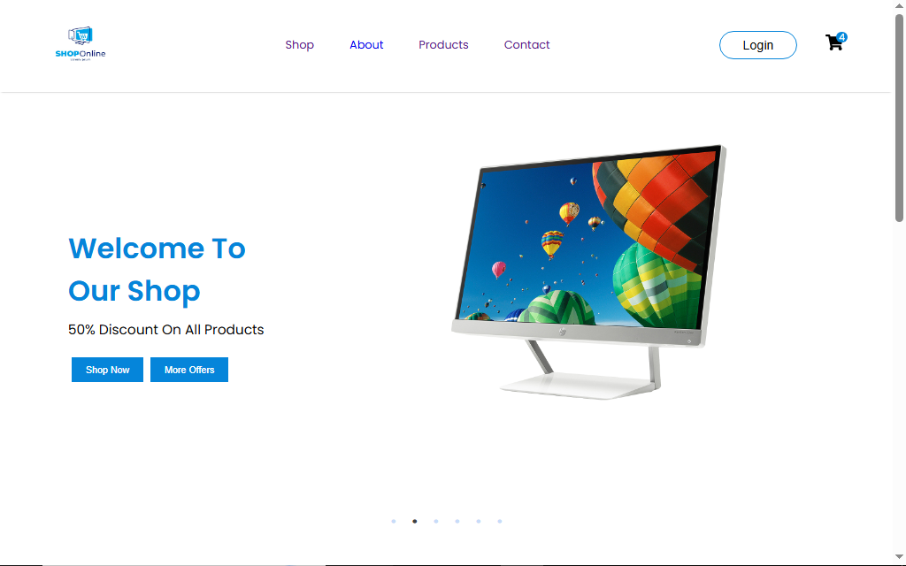

# ⚡ Electro Store

<div align="center">

### ⚡ Smart Technology • Modern Shopping • Better Experience

A modern and responsive electronics store built with **React, CSS, and JavaScript**.



</div>

---

## ✨ About The Project

**Electro Store** is a modern and responsive electronics e-commerce website designed to provide a clean, organized, and interactive shopping experience.

The project allows users to explore different categories of electronic products, filter products, add items to a shopping cart, manage quantities, and keep their cart data saved between sessions.

It was built as a frontend learning and practice project, focusing on practical **React development, reusable components, state management, responsive design, routing, and interactive UI functionality**.

---

## 🚀 Features

* 🏠 Modern and responsive homepage
* 💻 Electronics product collection
* 🗂️ Product category filtering
* 🛍️ Multiple product categories
* 🛒 Functional shopping cart
* ➕ Increase product quantity
* ➖ Decrease product quantity
* 🗑️ Remove products from cart
* 💰 Automatic cart total calculation
* 💾 Persistent cart using localStorage
* 📖 About section
* 📞 Contact section
* 🔐 Login page
* 🧭 React Router navigation
* 📱 Fully responsive design
* ✨ Interactive navigation and UI elements
* 🎨 Modern technology-focused visual design

---

## 🛠️ Technologies

<div align="center">


</div>

---

## 🎨 Design Highlights

* ⚡ Modern technology-inspired visual style
* 🔵 Clean and contemporary color palette
* ✨ Simple and polished layouts
* 🖥️ Product-focused visual presentation
* 🛍️ Modern and organized product cards
* 🎯 Clear and easy-to-use navigation
* 📱 Responsive layouts for different screen sizes
* 🛒 Clean shopping cart experience
* 💡 Interactive UI elements and hover effects

---

## 🛍️ Product Collection

The website includes a collection of electronic products displayed through reusable React product components.

The available categories include:

* 💻 Computers
* 💼 Laptops
* ⌚ Touch Watches
* 📷 Cameras
* 📺 TV Screens
* 📱 Mobiles

Product information is stored separately and rendered dynamically using React.

---

## 🗂️ Product Categories

The product section allows users to browse products by category for a more organized shopping experience.

Users can choose between:

* All Products
* Computers
* Laptops
* Watches
* Cameras
* TV Screens
* Mobiles

The selected category is managed using React state and the displayed products are updated dynamically.

---

## 🛒 Shopping Cart

The project includes a functional shopping cart for managing selected products.

Users can:

* Add products to the cart
* Increase product quantity
* Decrease product quantity
* Remove products
* View the total price
* Keep cart data after refreshing the page

The cart uses **React state** for managing products and **localStorage** for preserving cart data between sessions.

---

## ⚛️ React Architecture

The project uses reusable React components to keep the application organized and maintainable.

### Main Components

* `Navbar`
* `Shop`
* `Products`
* `ProductCard`
* `Cart`
* `About`
* `Contact`
* `LoginUp`
* `Footer`

The application uses **props, state, and React hooks** to manage product rendering, filtering, navigation, and shopping cart functionality.

---

## 📱 Responsive Design

The website is designed to provide a consistent experience across:

* 💻 Desktop
* 💻 Laptop
* 📱 Tablet
* 📱 Mobile

Responsive layouts were implemented using CSS media queries to ensure that navigation, product cards, grids, images, typography, and cart elements adapt smoothly to different screen sizes.

---

## 🎯 Project Goal

This project was created to strengthen practical frontend development skills by building a complete electronics e-commerce interface using React.

### Learning Focus

* React components
* Props
* React state
* `useState`
* `useEffect`
* Dynamic rendering
* Array methods
* Conditional rendering
* Product filtering
* Shopping cart state management
* LocalStorage
* React Router
* Responsive design
* Reusable components
* Component organization
* Data-driven UI

---

## 🌱 Future Improvements

* 🔎 Product search
* 📄 Product details pages
* 👤 Complete authentication
* 🛒 Advanced cart functionality
* 💳 Checkout and payment integration
* 📦 Order management
* ❤️ Wishlist functionality
* 🗄️ Backend integration
* 🔥 Database integration

---

## 🚀 Getting Started

### Clone the Repository

```bash
git clone https://github.com/asmaaportfolio/electro-store.git
```

### Open the Project

Open the project folder in **Visual Studio Code**.

### Install Dependencies

```bash
npm install
```

### Run the Project

```bash
npm start
```

The application will be available at the local development URL provided by Create React App.

---

## 👩‍💻 Author

**Asmaa Qandil**

Frontend Developer & Learner

Built with ❤️, React, and a passion for learning frontend development.

<div align="center">

⚡ **Explore Technology. Shop Smarter.** ⚡

⭐ If you like this project, consider giving it a star!

</div>
